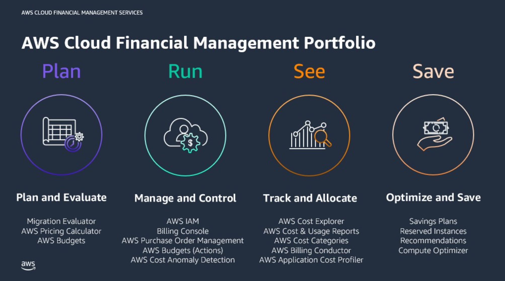

## AWS 비용 관리

> AWS는 클라우드 비용을 관리,추척,분석, 최적화할 수 있도록 돕는 여러 비용 관리 솔루션을 제공
>
> 이 솔루션들은 AWS 비용을 보다 투명하게 보고하고, 예산을 설정/모니터링하며, 절약 기회를 찾을 수 있게 해줌

## AWS 비용 관리 솔루션

#### AWS Billing Conductor

- 완전관리형 비용 구성 서비스
- 월별 결제 데이터를 사용자 정의 형식으로 구성해서, 고객/사업부/요금 그룹 간 정산 워크플로우를 지원
- 실제 청구 방식은 변경하지 않지만, 청구 데이터를 맞춤 형태로 표시, 분석할 수 있게 해줌

 

#### AWS Cost Explorer

- 비용 및 사용량 데이터 시각화 도구
- 시간 경과에 따른 비용/사용량 차트 및 테이블로 보고 분석할 수 있고, 사용자 지정 보고서를 만들 수 있음
- 예를 들어 특정 태그가 달린 리소스만 필터링해서 비용 분석이 가능