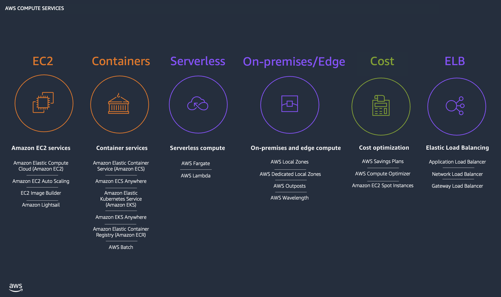

## 카테고리

| 분류 | 서비스 |
|-|-|
| 인스턴스(가상 머신) | Amazon EC2, Amazon EC2 Spot, Amazon EC2 Auto Scaling, Amazon Lightsail |
| 컨테이너 | AWS App Runner, AWS Fargate |
| 서버리스 | AWS Lambda |
| 엣지/하이브리드 | AWS Outposts, AWS Wavelength, VMware Cloud on AWS |
| 비용 및 용량 관리 | Savings Plans, Compute Optimizer |

## 주요 컴퓨팅 서비스

#### Amazon EC2 (Elastic Compute Cloud)

- AWS에서 안정적이고 확장 가능한 가상 서버를 제공하는 핵심 서비스
- 사용자는 인스턴스를 신속하게 시작,중지,확장,축소할 수 있으며 사용한 만큼 비용을 지불
- 다양한 인스턴스 유형 및 크기가 제공되어 워크로드에 맞는 컴퓨팅 성능을 선택할 수 있음

 

#### Amazon EC2 Auto Scaling

- EC2 인스턴스 수요 변화에 따라 자동으로 늘리거나 줄이는 기능을 제공
- 워크로드 트래픽에 따라 동적/예측 자동 조정이 가능

 

#### Amazon EC2 Image Builder

- VM 및 컨테이너 이미지를 자동으로 생성, 업데이트, 유지 관리할 수 있는도구
- 수동 업데이트나 커스텀 자동화 스크립트 없이 안전한 이미지 파이프라인을 구축할 수 있음

 

#### AWS Lightsail

- 서버, 스토리지, 네트워크 등이 통합된 쉬운 VM 서비스로, 저렴하고, 예측 가능한 요금제 기반으로 간단한 애플리케이션/웹사이트를 빠르게 시작할 수 있음

 

#### AWS App Runner

- 컨테이너 기반 웹 애플리케이션, API를 사전 인프라 지식 없이 배포할 수 있는 완전 관리형 서비스
- 소스코드나 컨테이너 이미지를 입력하면 자동으로 배포 및 로드밸런싱, 스케일링을 처리

 

#### AWS Batch

- 배치 컴퓨팅 작업을 대규모로 자동으로 스케줄, 실행하는 서비스
- 필요에 따라 컴퓨팅 리소스를 자동으로 프로비저닝함\

 

#### AWS Elastic Beanstalk

- 웹 애플리케이션 및 서비스를 간편하게 배포 및 운영할 수 있는 플랫폼형 서비스
- 코드 업로드만으로 프로비저닝, 로드 밸런싱, 오토스케일링 등을 자동화함

 

#### AWS Fargate

- 컨테이너를 실행하기 위한 서버리스 컴퓨팅 엔진
- 서버/클러스터 고나리 없이 컨테이너만 정의하면 실행할 수 있게 해줌

 

#### AWS Lambda

- 서버를 직접 프로비저닝/관리할 필요 없이 코드만 실행하는 서버리스 컴퓨팅 서비스
- 코드가 호출될 때만 비용이 발생

 

#### AWS Serverless Application Repository

- 공통 서버리스 애플리케이션 구성 요소/템플릿을 공유,배포할 수 있는 리포지토리
- AWS SAM 템플릿 기반 배포를 지원