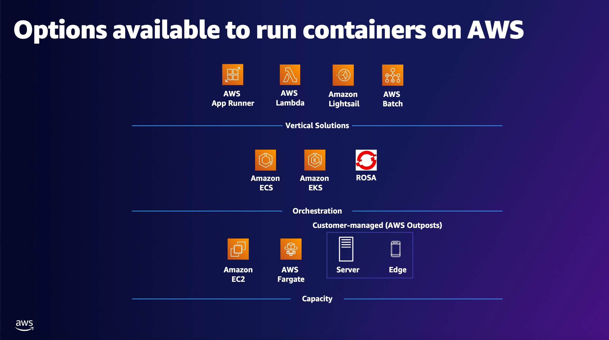

## AWS 컨테이너 서비스

> AWS 컨테이너 서비스는 컨테이너 이미지 저장,관리부터 오케스트레이션, 실행까지 전체 라이프사이클을 지원
>
> 이를 통해 기본 인프라에 대한 고민 없이 컨테이너 기반 애플리케이션을 구축, 배포, 운영할 수 있음

## AWS 컨테이너 관련 서비스 목록

#### Amazon Elastic Container Registry (Amazon ECR)

- Docker 컨테이너 이미지를 안전하게 저장, 관리 및 배포할 수 있는 완전 관리형 컨텐이너 레지스트리
- Amazon ECS와 통합되어 컨테이너 워크플로우를 단순화함
- 사용자는 리포지토리에 저장된 데이터 및 전송량에 대해서만 비용을 지불

 

#### Amzon Elastic Container Service (Amazon ECS)

- Docker 컨테이너를 손쉽게 실행, 확장할 수 있는 고성능 컨테이너 오케스트레이션 서비스
- 자체 오케스트레이션 소프트웨어 설치나 관리가 필요 없음
- 단순 API 호출로 애플리케이션 시작/중지, 상태 조회, 보안 구성, 로드밸런싱 등 다양한 기능과 통합하여 사용할 수 있음

 

#### Amazon Elastic Kubernetes Service (Amazon EKS)

- Kubernetes 기반 컨테이너화된 애플리케이션을 배포,관리,확장하는 완전관리형 Kubernetes 서비스
- 여러 가용 영역에서 Kubernetes 관리 인프라를 실행하여 단일 장애 지점 제거와 높은 가용성을 제공
- 표준 Kubernetes 환경과 호환되어 기존 Kubernetes 도구 및 워크로드 마이그레이션이 쉬움

 

#### AWS App2Container (A2C)

- .NET 및 Java 애플리케이션을 컨테이너화된 애플리케이션으로 현대화하는 명령줄 도구
- 애플리케이션 인벤토리 분선 ➡️ 필요한 종속성/아티팩트 식별 ➡️ 컨테이너 이미지 패키징 ➡️ ECS 작업 정의/Kubernetes 포드 정의 생성까지 자동화
- 이를 통해 기존 애플리케이션을 컨테이너 기반으로 배포, 운영할 수 있음