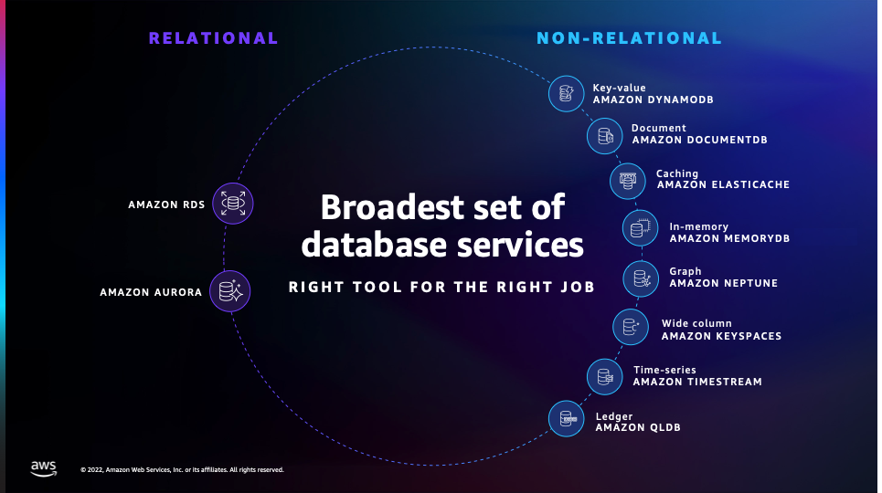

## AWS 데이터베이스 서비스 

> AWS는 다양한 관리형 데이터베이스 서비스를 제공하여 애플리케이션 개발자가 데이터 저장, 관리, 검색, 분석 등 다양한 데이터 워크로드를 쉽게 처리할 수 있도록 지원
>
> 데이터베이스는 관계형, NoSQ, 캐싱, 그래프, 시계열 등 여러 목적에 맞는 옵션을 제공

## AWS Database 서비스 목록

#### Amazon Aurora

- 고성능, 고가용성 관계형 데이터베이스
- MySQL 및 PostgreSQL 호환
- 자동 복제, 백업, 장애 조치 등을 제공

 

#### Amazon RDS (Relational Database Service)

- 완전 관리형 관계형 데이터베이스 서비스
- 여러 엔진 지원
- 자동 백업 소프트웨어 패치, 모니터링 기능 제공
