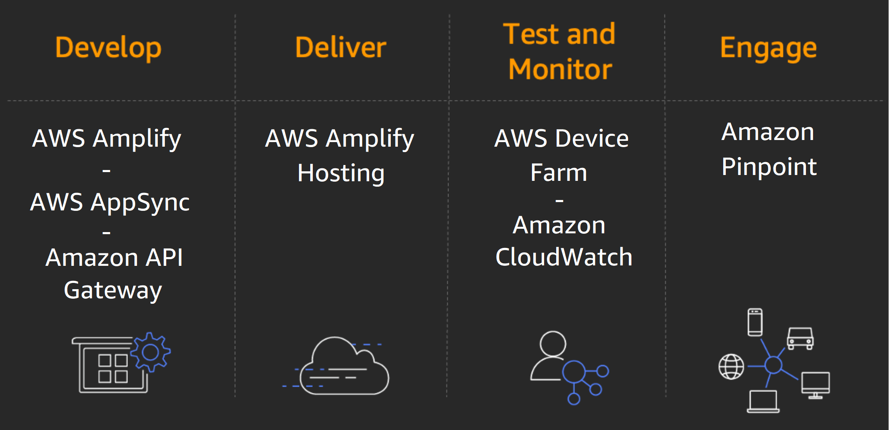

## AWS 모바일 서비스

> AWS는 네이티브 iOS, Android, React Native 및 JavaScript 기반 모바일/프론트엔드 앱 개발 워크플로우를 지원하는 여러 서비스를 제공

## AWS 모바일 / 프론트엔드 서비스 목록

#### AWS Amplify

- 확장 가능 모바일 애플리케이션 개발 프레임워크 및 백엔드 관리 서비스
- Amplify는 모바일 백엔드를 자동으로 프로비저닝, 관리하며, 인증, 분석, 오프라인 데이터 동기화 등 기능을 선택적으로 구성할 수 있음
- iOS, Android, 웹, React Native 등 다양한 프론트엔드 환경과 쉽게 통합할 수 있도록 라이브러리 및 UI 구성 요소를 제공
- 또한 프론트엔드와 백엔드 모두에 대한 릴리스 프로세스를 자동화하여 개발 속도를 높임

 

#### AWS AppSync

- 서버리스 그래프 QL 기반 백엔드 서비스로, 모바일 및 웹 애플리케이션의 데이터 액세스/동기화/조작을 안전하게 처리
- 온라인 및 오프라인 데이터 액세스를 지원하며, 여러 데이터 소스를 API 하나로 통합할 수 있음
- 데이터 요구를 Graph QL 쿼리로 정의하여 네트워크 사용량을 최적화하고, 실시간 업데이트 및 오프라인 동기화를 지원