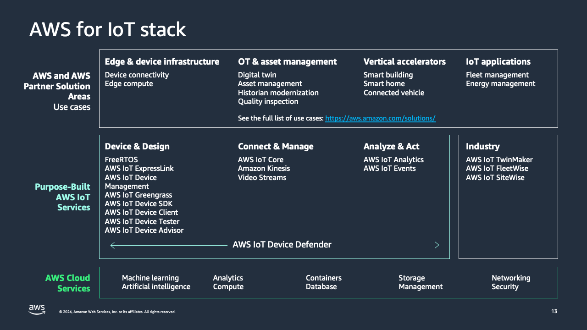

## AWS IoT 서비스

> AWS는 수십억 개의 디바이스를 연결, 관리하고  IoT 데이터를 수집, 분석할 수 있는 다양한 IoT 서비스와 솔루션을 제공

## 주요 AWS IoT 서비스 목록

#### AWS IoT Analytics

> 완전관리형 IoT 데이터 분석 서비스

- IoT 디바이스가 생성한 시계열 데이터를 필터링, 변환, 보강하고 저장 후 SQL 쿼리또는 머신러닝 분석을 수행할 수 있음
- 분석 파이프라인을 자동화하고 확장하여 수백만 디바이스의 데이터를 처리할 수 있음

 

#### AWS IoT Button

>  프로그래밍 가능한 Wi-Fi 버튼 하드웨어

- 코드를 거의 작성하지 않고 클라우드 기능을 트리거할 수 있도록 설계되어 있음
- 버튼 클릭을 통해 알림 전송, 카운터 증가, 서비스 시작/중지 등 동작을 수행할 수 있음

 

#### AWS IoT Core

> 연결된 디바이스가 클라우드 및 다른 디바이스와 안전하게 통신할 수 있도록 하는 관리형 서비스

- 수십억 디바이스와 수조 개의 메시지를 처리할 수 있으며, 데이터 수집/처리/라우팅 기능을 제공
- AWS Lambda, Kinesis, S3, SageMaker 등 다른 AWS 서비스와 쉽게 통합됨

 

#### AWS IoT Device Defender

> IoT 디바이스 플릿 보안 서비스

- 디바이스 구성을 지속적으로 감사하여 보안 모범 사례 준수 여부를 점검
- 비정상적인 동작을 감지하고 알림을 생성하여 보안 이슈를 빠르게 파악할 수 있게 함

 

#### AWS IoT Device Management

> 대규모 IoT 디바이스 배포를 안전하게 온보딩/관리/모니터링할 수 있는 서비스

- 디바이스 등록, 구성, 펌웨어 OTA 업데이트, 상태 모니터링 등 원격 관리 기능을 제공

 

#### AWS IoT Events

> IoT 센선 데이터에서 이벤트를 감지하고 대응할 수 있는 서비스

- 복잡한 이벤트 패턴을 정의하고, 조건에 맞는 알림/작업을 자동으로 실행할 수 있음

 

#### AWS IoT ExpressLink

> IoT 디바이스를 빠르고 안전하게 AWS 클라우드에 연결하기 위한 하드웨어 모듈 지원 서비스

- 보안 자격 증명이 사전 프로비저닝된 파트너 모듈을 사용하여 클라우드 연결 및 통합 복합성 감소를 도움

 

#### AWS IoT FleetWise

> 차량 데이터를 수집/표준화/전송하는 서비스

- 조건 기반 데이터 수집 규칙을 정의하고, 클라우드로 효율적으로 전송하여 분석 및 ML 활용에 적합한 데이터 형태로 저장

 

#### AWS IoT Greengrass

> IoT 디바이스를 클라우드 확장/로컬 실행 환경으로 확장하는 서비스

- 인터넷 연결이 없더라도 로컬에서 Lambda 함수 실행, 데이터 동기화, 기계학습 실행 등이 가능

 

#### AWS IoT SiteWise

> 산업 장비 데이터를 수집/구성/모니터링하는 관리형 서비스

- 시설 운영 상태를 중앙에서 모니터링하고 성능 지표를 계산하여 데이터 기반 의사결정을 지원

