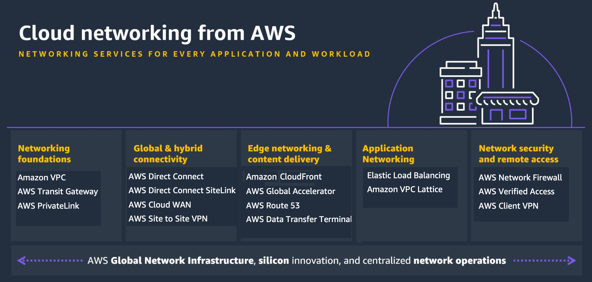

## AWS 네트워킹 서비스

> AWS 클라우드에서 높은 신뢰성, 보안, 성능을 제공하는 폭넓은 네트워킹 및 콘텐츠 전송 서비스를 제공함 
>
> 이것이 사용자의 애플리케이션, 데이터 및 서비스가 최적의 성능과 연결성을 갖도록 돕는 핵심 인프라 컴포넌트

## 네트워킹 & 콘텐츠 전송 주요 서비스

#### Amazon API Gateway

- API를 쉽게 생성/게시/관리/보호할 수 있는 완전관리형 API 서비스
- 백엔드 서비스와의 트래픽 관리, 권한 제어, 모니터링을 처리함

 

#### AWS App Mesh

- 마이크로서비스 간 트래픽을 제어하고 가시성/신뢰성을 제공하는 서비스 메시
- Envoy 프록시 기반으로 서비스 간 통신을 표준화함

 

#### Amazon CloudFront

- 빠르고 안전한 콘텐츠 전송 네트워크 서비스로, 전 세계 사용자에게 데이터를 전송

 

#### AWS Cloud Map

- 애플리케이션 리소스를 서비스 디스커버리 형태로 등록/조회할 수 있는 서비스
- 동적 환경에서 리소스 위치를 최신 상태로 유지해 줌

 

#### AWS Direct Connect

- 온프레미스 네트워크와 AWS 간 전용 네트워크 연결을 설정하여 안정적이고 일관된 네트워크 환경을 제공

 

#### Elastic Load Balancing (ELB)

- 애플리케이션 트래픽을 여러 대상으로 자동 분산하여 고가용성을 제공

 

#### AWS Global Accelerator

- 글로벌 사용자에게 제공하는 애플리케이션의 성능과 가용성을 개선하는 서비스
- AWS 글로벌 네트워크를 이용해 트래픽을 최적 경로로 라우팅 함

 

#### Integrated Private Wireless on AWS

- CSP와 협력하여 프라이빗 4G/5G 네트워크를 AWS 서비스와 통합하는 프로그램

 

#### AWS PrivateLink

- AWS 서비스 또는 VPC 간 프라이빗 연결을 제공하여 데이터가 퍼블릭 인터넷을 통해 노출되지 않도록 함

 

#### AWS Private 5G

- AWS가 제공하는 프라이빗 5G 네트워크 구축 서비스로, 사설 셀룰러 네트워크를 빠르게 배포할 수 있음

 

#### Amazon Route 53

- 확장 가능하고 가용성이 높은 DNS 웹 서비스
- 도메인 이름 해석, 트랙픽 라우팅, 도메인 등록 등을 지원

 

#### AWS Transit Gateway

- 여러 VPC와 온프레미스 네트워크를 단일 게이트웨이로 연결해 중앙 집중식 라우팅을 제공