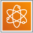

## AWS 양자 기술 

> AWS는 미래 컴퓨팅 기술인 양자 컴퓨팅 및 관련 양자 기술을 지원하고 연구하기 위한 기술 플랫폼 및 서비스를 제공하고 있음

 

#### Amazon Braket - 완전관리형 양자 컴퓨팅 서비스

- AWS에서 가장 대표적인 양자 컴퓨팅 서비스는 Amazon Braket
- Braket은 연구자와 개발자가 양자 알고리즘을 탐색, 개발, 테스트 및 실행할 수 있도록 설계된 완전관리형 양자 컴퓨팅 환경

 

## 양자 기술 관련 AWS 관점

#### 양자 컴퓨팅의 클라우드 활용

- 양자 컴퓨팅은 양자 역학의 원리를 이용하여 기존 컴퓨터로는 해결하기 어려운 특정 계산 문제를 빠르게 해결할 가능성이 있는 차세대 컴퓨팅 기술
- AWS는 이를 위해 Amazon Braket과 함께 양자 알고리즘 연구 및 실험 환경을 클라우드 상에서 제공함으로써, 연구자/기업이 접근성과 생산성을 높일 수 있도록 함