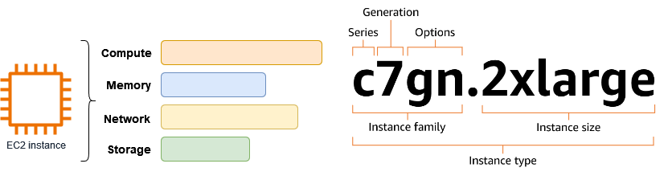

## Amazon EC2 주요 기능

> Amazon EC2는 AWS 클라우드에서 온디맨드 방식으로 컴퓨팅 용량을 제공하는 서비스

## 인스턴스 (Instances)

- 가상 서버 역할을 하는 EC2의 기본 실행 단위
- 인스턴스를 시작/중지/종료하는 등 직접 제어 가능

## Amazon Machine Images (AMIs)

- 운영 체제와 필요한 소프트웨어 구성이 포함된 EC2 인스턴스 템플릿임
- 이 AMI를 기반으로 여러 인스턴스를 쉽게 생성할 수 있음

## 인스턴스 타입 (Instance Types)

- 각 인스턴스 타입은 컴퓨팅, 메모리, 스토리지, 네트워크 성능의 서로 다른 조합을 제공
- 워크로드 요구 사항에 따라 적합한 타입을 선택할 수 있음

## Amazon EBS 볼륨 (Elastic Block Store)

> 독립적인 영구 스토리지를 인스턴스에 연결할 수 있는 기능

- 인스턴스를 중지/종료해도 데이터 유지 
- 다양한 크기와 성능 옵션 제공

## 인스턴스 스토어 볼륨 (Instance Store)

> 인스턴스와 함께 제공되는 임시 스토리지

- 인스턴스 종료 또는 중지 시 데이터가 삭제됨
- 고속 로컬 스토리지가 필요한 경우 유용한지만 영구 저장은 아님

## 키 페어 (Key Pairs)

> EC2 인스턴스에 SSH/RDP로 로그인할 때 사용하는 공개/개인 키 쌍임

- AWS는 공개 키를 저장
- 사용자는 개인 키를 안전하게 관리

## 보안 그룹 (Security Groups)

> 인스턴스에 대한 가상 방화벽 설정

- 허용할 프로토콜/포트/IP 범위
- 인바운드/아웃바운드 트래픽 제어 가능

## 추가로 참고할 EC2 기능 범위

- Auto Scaling & EC2 Fleet: 수요에 따라 인스턴스 수 자동 조정 및 다양한 구매 옵션을 통한 최적 용량 프로비저닝 지원
- 하이버네이트: EBS 기반 인스턴스를 메모리 상태까지 저장하고 재개 가능
- CPU 최적화 기능: vCPU 개수 설정 또는 하이퍼스레딩 비활성화 등 고급 CPU 제어 옵션
- 향상된 네트워킹/EFA: 고성능 네트워크 및 노드 간 통신 가속화를 지원하는 옵션

## 요약

| 기능 항목 | 설명 |
|-|-|
| 인스턴스 | AWS 클라우드에서 실행되는 가상 서버 |
| AMIs | 인스턴스 구성 템플릿 |
| 인스턴스 타입 | CPU/메모리/네트워크/스토리지 조합 |
| EBS 볼륨 | 영구 블록 스토리지 |
| 인스턴스 스토어 | 임시 로컬 스토리지 |
| 키 페어 | SSH/RDP 로그인용 공개/개인 키 쌍 |
| 보안 그룹 | 가상 방화벽 룰 |