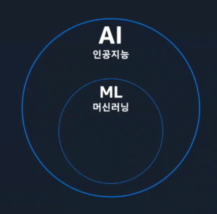

## 생성형 AI와 머신러닝과 다른점

- 머신러닝: 인간을 모방한 문제 해결 능력을 갖춘 학습된 모델
- 머신러닝의 모델 생성 과정: 데이터 준비 / 모델 훈련 / 모델 평가 / 배포 및 관리
- 생성형 AI: 방대한 데이터 뭉치들에 대해 사전 학습된 대규모 모델을 기반으로 하며, 일반적으로 Foundation Models(FM)이라고 함

---

## RAG(검색 증강 생성)

#### RAG 사용 이유

- 도메인 특화 지식 부족
- 지식 단절
- 환각
- 즉, 특정 작업의 성능 향상을 위해 커스터마이징이 필요

 

#### 커스터마이징 방법

1. 사전에 훈련된 모델로 인컨텍스트 학습
2. RAG 사용

 

#### RAG 필요성 - 특정 지식을 위한 LLM

- 환각에 대한 문제점을 해결할 수 있음
- 특정 지식을 보여주기 위해서는 해당 회사에 대한 context가 필요

 

#### RAG의 동작 과정

1. 쿼리
2. 지식 저장소에서 모든 관련 데이터를 빠르게 찾음
3. 검색된 정보들에 대한 질문과의 관련성을 기준으로 점수를 산정해 순위를 매김
4. 순위가 높게 책정된 데이터를 원래 쿼리와 함께 컨텍스트로 추가
5. 답변 생성

 

#### 검색 방법

- 규칙 기반: 문서와 같은 구조화되지 않은 비정형 데이터 가져오기
- 구조회된 데이터: DB 또는 API에서 트랜잭션 검색
- 시맨틱 검색: 텍스트 임베딩을 기반으로 관련 문서 가져오기

 

#### 임베딩(Embedding)

- 고차원의 정보(텍스트, 이미지 등)를 기계가 이해할 수 있는 숫자의 나열인 벡터로 바꾸는 과정/결과

 

#### 임베딩 모델

- 단어 간의 의미와 관계를 다차원 공간의 숫자로 표현
- 임베딩 모델은 텍스트의 특징과 뉘앙스를 포착
- 임베딩을 사용하여 텍스트 유사성을 비교
- 다국어 텍스트 임베딩은 다양한 언어의 의미를 식별

 

#### RAG에서 임베딩이 중요한 이유

- 의미론적 관계를 기반으로 텍스트 검색을 강화
- 벡터 저장소엣거 의미론적으로 더 정확한 컨텍스트로 프롬프트를 보강하는 데 사용
- 정확도가 높은 임베딩을 통해 컨텍스트를 개선하고 사용자 쿼리에 대한 파운데이션 모델 생성 응답의 품질 향상

---

