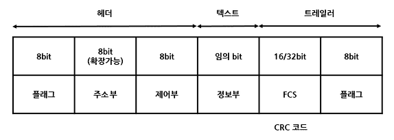

## 통신 방식

#### 단방향 통신 (Simplex Communication)

- 한쪽 방향으로만 전송이 가능한 방식
- 예: TV, 라디오

 

#### 반이중 통신 (Half-Duplex Communication)

- 양방향 전송이 가능하지만 동신에 양쪽 방향에서 전송할 수 없는 방식
- 2선식 선로를 사용하여 송신과 수신을 번갈아 전송
- 예: 무전기 모뎀

 

#### 전이중 통신 (Full-Duplex Communication)

- 동시에 양방향 전송이 가능한 방식
- 4선식 선로를 사용하여 주파수 분할을 이용할 경우 2선식도 가능
- 전송량이 많고 전송 매체의 용량이 클 떄 사용
- 예: 전화, 전용선을 이용한 통신

## 동기식/비동기식 전송

#### 동기식

- 블록과 블록 사이에는 휴지 시간(Idle Time) 이 없음
- 프레임 단위로 전송하므로 전송 속도가 빠름
- 시작/종료 비트로 인한 오버헤드가 없고 휴지시간이 없으므로 전송 효율이 높음
- 주로 원거리 전송에 사용
- 단말기는 반드시 버퍼 기억장치를 내장해야 함

 

#### 비동기식 전송

- 시작 비트, 전송 문자, 정지 비트로 구성된 한 문자를 단위로 하여 전송하며, 오류 검출을 위한 패리티 비트를 추가하기도 함
- 문자와 문자 사이의 휴지시간(Idle Time)이 불규칙함
- 한꺼번에 많은 데이터를 보내면 프레이밍 에러의 가능성이 높아짐
- 단거리 전송에 사용
- 동기화가 단순하고 가격이 저렴
- 전송 효율이 낮음

## 전송 제어 절차

- OSI 7 참조 모델의 데이터 링크 계층에서 수행하는 기능
- 전송 제어에 사용되는 프로토콜을 전송 제어 프로토콜 또는 데이터 링크 제어 프로토콜이라고 함
- 전송 제어 5단계

1. 데이터 통신 회선의 접속
2. 데이터 링크 설정(확립)
3. 정보 메시지 전송
4. 데이터 링크 종결
5. 데이터 통신 회선의 절단

## HDLC(High-level Data Link Control)

> 비트 위주의 프로토콜로 각 프레임에 데이터 흐름을 제어하고 오류를 보정할 수 있는 비트 열에 삽입하여 전송

- 포인트 투 포인트 및 멀티 포인트, 루프 방식에서 모두 사용 가능
- 단방향, 반이중, 전이중 통신을 모두 지원하며 동기식 전송 방식을 사용
- 에러 제어를 위해 Go-Back-N ARQ와 선택적 재전송(Selective Repeat) ARQ 를 사용
- 흐름 제어를 위해 슬라이딩 윈도우 방식을 사용
- 전송 제어상의 제한을 받지 않고 자유로이 비트 정보를 전송할 수 있음
- 전송 효율과 신뢰성이 높음

- 플래그: 프레임의 시작과 끝을 나타내는 공유한 비트 패턴(비트 투과성을 이용한 기본적인 오류 검출 등의 기능을 수행)
- 주소부(Address Field): 송/수신국을 식별하기 위해 사용
- 제어부(Control Field): 
  - 정보 프레임(Information Frame): 사용자 데이터를 전달
  - 감독 프레임(Supervisory Frame): 오류 제어와 흐름 제어를 수행
  - 비(무)번호 프레임(Unnumbered Frame): 회선의 설정, 유지 및 종결을 담당
- 정보부(Information Field): 실제 정보 메시지가 들어있는 부분
- FCS(Frame Check Sequence): 프레임 내용에 대한 오류 검출을 위해 사용되는 부분으로 일반적으로 CRC 코드가 사용

- HDLC의 데이터 전송 모드: 표준 응답 모드 (NRM), 비동기 응답 모드(ARM), 비동기 균형 모드(ABM)

## 오류 발생 원인

| 오류 발생 원인 |  현상 |
|-|-|
| 감쇠(Attenuation) | 전송 신호 세력이 전송 매체를 통과하는 과정에서 거리에 따라 약해지는 현상 |
| 지연 왜곡(Delay Distortion) | 하나의 전송 매체를 통해 신호를 전달했을 때 주파수에 따라 그 속도가 달라짐으로 생기는 오류 |
| 백색 잡음(White Noise) | 전송 매체 내부에서 온도에 따라 전자의 운동량이 변화함으로써 생기는 잡음 |
| 상호 변조 잡음(Intermodulation Noise) | 두개 이상의 주파수들이 하나의 전송 매체를 공유할 때 발생하는 잡음 |
| 누화잡음 = 혼선(Cross Talk Noise) | 인접한 전송 매체의 전자기적 상호 유도 작용에 의해 생성되는 잡음 |
| 충격성 잡음 | 외부적인 충격에 의해 발생하는 잡음 |

## 자동 반복 요청

- 정지-대기
  - 송신 측에서 한 개의 블록을 전송한 후 수신 측으로부터 응답을 기다리는 방식
  - 구현방법이 가장 단순하지만, 전송 효율이 떨어짐
- 연속
  - 연속적으로 데이터 블록을 보내는 방식
  - Go-Back-N ARQ: 오류가 발생한 블록 이후의 모든 블록을 재전송하는 방식
  - 선택적 재전송 ARQ: 오류가 발생한 블록만을 재전송하는 방식
- 적응적 ARQ
  - 블록 길이를 채널의 상태에 따라 그때그때 동적으로 변경하는 방식
  - 제어 회로가 복잡하고 비용이 많이 들어 거의 사용하지 않음

## 오류 검출 방식

#### 패리티 검사(Parity Check)

- 데이터 블록에 1비트의 검사 비트인 패리티 비트를 추가하여 오류를 검출
- 가장 간단하지만 2개 이상의 비트에 오류가 발생하면 검출이 불가능
- 오류만 검출 가능하며 수정을 불가능

 

####