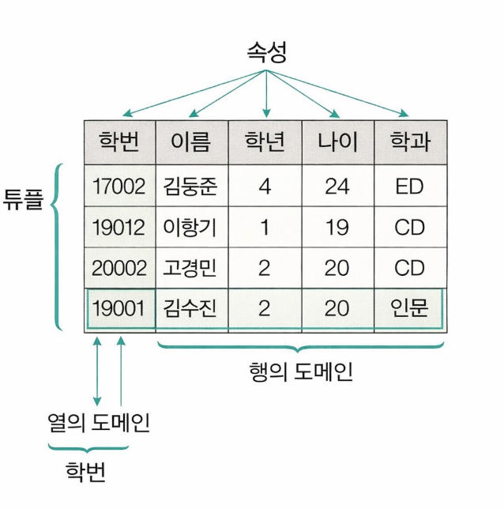

## 개요

- 1970년에 처음 제안됨
- 관계형 데이터베이스를 구성하는 개체나 관계를 모두 릴레이션이라는 표로 구현
- 릴레이션은 개체를 표현하는 개체 릴레이션, 관계를 나타내는 관계 릴레이션으로 구분할 수 있음
- 장점: 간결하고 보기 편리하며, 다른 데이터베이스로의 변환이 용이
- 단점: 성능이 다소 떨어짐

---

## 관계형 데이터베이스의 Relation 구조

> 랄레이션은 데이터들을 표의 형태로 표현한 것으로 구조를 나타내는 릴레이션 스키마와 실제 값들인 릴레이션 인스턴스로 구성됨

 

#### 튜플(Tuple)

- 튜플은 릴레이션을 구성하는 각각의 행을 말함
- 튜플은 속성의 모임으로 구성됨
- 파일 구조에서 레코드와 같은 의미
- 튜플의 수는 카디널리티 또는 기수, 대응수라고 함

 

#### 속성(Attribute)

- 속성은 데이터베이스를 구성하는 가장 작은 논리적인 단위
- 파일 구조상의 데이터는 항목 또는 데이터 필드에 해당함
- 속성은 개체의 특성을 기술함
- 속성의 수를 디그리 또는 차수라고 함

 

#### 도메인(Domain)

- 도메인은 하나의 애트리뷰트가 취할 수 있는 같은 타입의 원자값들의 집합
- 도메인은 실제 애트리뷰트 값이 나타날 때 그 값의 합법 여부를 시스템이 검사하는데 사용됨

---

## 릴레이션의 특징

- 한 릴레이션에는 똑같은 튜플이 포함될 수 없으므로 릴레이션에 포함된 튜플들은 모두 상이함
- 한 릴레이션에 포함된 튜플 사이에는 순서가 없음
- 튜플들의 삽입, 삭제 등의 작업으로 인해 릴레이션은 시간에 따라 변함
- 릴레이션 스키마를 구성하는 속서들 간의 순서는 중요하지 않음
- 속성의 유일한 식별을 위해 속성의 명칭은 유일해야 하지만, 속성을 구성하는 값은 동일한 값이 있을 수 있음
- 릴레이션을 구성하는 튜플을 유일하게 식별하기 위해 속성들의 부분집합을 키로 설정함
- 속성의 값은 논리적으로 더 이상 쪼갤 수 업슨 원자값만을 저장함