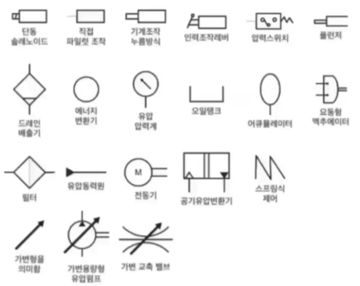

## 유압이란

- 유압 = 단위 단면적에 가해지는 힘의 세기
- 압력단위: Pa, kPa, psi, mmHg, bar, atm
- 유량 = 단위시간에 이동하는 유체의 체적

---

## 파스칼원리

- 유체의 압력은 직각으로 동일한 압력이 작용함
- 밀폐용기 안의 액체 일부에 가해진 압력은 각 부분에 동시에 같은 크기로 전달됨

---

## 유압유의 점도

#### 점도가 낮을 때

- 유압이 떨어짐
- 오일 누설
- 펌프 효율 저하

#### 점도가 높을 때

- 유압 상승
- 온도 상승
- 마찰손실로 동력 손실 발생

---

## 공동현상[캐비테이션] 현상

> 오일 내 용해된 공기가 기포로 발생
>
> 국부적 압력 상승과 소음진동 발생
> 
> 필터가 너무 촘촘할 때 발생

---

## 유압장치

#### 구성

- 유압발생장치
- 유압구동장치
- 유압제어장치

 

#### 유압장치의 장점

- 에너지 손실이 적음
- 작은동력으로 큰 힘을 내며 속도제어가 쉬움
- 조작이 간단하며 힘의 증폭이 가능
- 신속한 응답성과 정확한 위치제어
- 무단변속과 자동제어 가능

 

#### 유압장치의 단점

- 화재의 위험이 있음
- 고압 위험성
- 이물질이나 공기 혼입에 취약
- 연결부위의 누출
- 온도에 따른 점도 변화
- 유지관리 어려움

---

## 액추에이터

> 유압 에너지를 기계에너지로 변환하는 장치
> 
> 대표적증로 액추에이터에는 유압모터/유압실린더가 있음

--- 

## 유압모터

> 유압 모터는 유압에너지의 속도를 이용 조정함으로써 회전운동을 하는 장치
>
> 유압모터의 용량은 `입구 압력당 코드`로 나타냄

- 유압모터의 종류 기어형, 베인형, 플런저형
- 베인형: 베인사이에 유입된 유체에 의해 로터가 회전
- 플런저형: 고압에 적합, 최고 토풀압력, 평균 효율이 가장 높음. 대형이고 비쌈
- 기어형: 구조간단, 가격저렴, 평기어

#### 특징

- 오일점도에 영향을 받음
- 무단변속이 용이
- 유량조절 방향제어가 쉬움
- 급정지가 용이
- 비교적 신속하고 정확하게 작동
- 오일누유 위험성이 있음
- 화재발생 위험이 있음
- 먼지나 공기혼입 위험성이 있음

---

## 유압 실린더

- 유압 펌프에서 보내진 유압 에너지로 피스톤의 직성운동을 만들어냄
- 종류: 단동실린더, 복동실린더, 다단 실린더
- 구성품: 피스톤, 피스톤로드, 실린더, 쿠션기구, 실
  
 

#### 특징
- 자동속도 조절은 유량으로 함 유량 부족시 작동속도는 느려짐
- 유압 실린더 교환시 누유 및 작동상태를 점검하고, 공기빼기 작업을 함
- 유압실린더의 과도한 자연낙하 현상 원인
  - 컨트롤밸브 스풀 마모
  - 릴리프밸브 조정 불량
  - 오일링 마모

 

#### 유압 펌프의 종류

- 기어펌프: 회전펌프 간단구조, 저렴, 효율 별로, 흡입력 좋은, 마모, 오일부족, 흡입관이 막히면 
- 베인펌프: 회전펌프처럼 간단한 구조, 경량, 유지관리 쉬움, 수명 길다

 

#### 숨틀리기 현상

> 유압으로 작동하는 실린더 등의 장치가 작동 중 순간적으로 멈칫하며 작동이 지연되는 현상
>
> 원인: 서지압 발생. 공기혼입으로 유체압력을 전달하는 피스톤의 작동이 불안정하여 발생

---

## 유압펌프

#### 종류 [기로베플]

- 기어펌프, 로터리펌프, 베인펌프, 플런저펌프

 

#### 기어펌프

- 회전펌프 간단구조, 저렴, 효율별로, 흡입력 좋음
- 펌프베어링 마모, 오일 부족, 흡입관  막히면 소음발생

 

#### 베인펌프

- 회전펌프 간단구조, 경량, 유지관리 쉬움, 수명 길다

 

#### 플런저펌프

- 피스톤펌프 구조복잡, 비쌈, 흡입능력 나쁨, 최고압토출, 가변용량 토출 가능, 고압대 출력, 수명 길다

 

#### 로터리펌프 [트로코이드펌프]

- 안쪽 내외 로터 2개
- 바깥쪽 하우징으로 구성된 펌프

 

#### 특징

- 펌프용량은 토출량으로 표시
- 유압펌프의 오일 토출량이 부족하면 회전속도가 느려지고, 토출량이 크면 회전속도가 빨라짐
- 오일 누설이나 작동부가 마모, 파손되면 펌프회전속도가 느려짐

---

## 오일(유압유) 탱크

#### 오일탱크 구성품 [플스주면베플]

- 드레인플러그: 탱크 내 오일 전부 배출
- 스트레이너: 흡입구에 설치 불순물 필터
- 주입구캡: 유면계 적정오일량 나타냄
- 베플플레이트: 칸막이로 기포 분리 제거

 

#### 기능

- 필요 유량 확보
- 방열, 온도 유지
- 불순물 혼인 방지
- 기포분리 제거

---

## 기타 유압부품

- 배관이음으로 호이스팅형 유압호스연결부에 쓰이는 것은
  - 유니온조인트
- 유압호스 중 가장 큰 압력에 견디는 것은
  - 나선 와이어 브레이드
- 유압장치의 수명 연장을 위해 가장 중요한 것은?
  - 정기적으로 오일필터를 점검 교환함       

#### 오일 실

- 유압계통의 오일누출 방지 역할
- 수리할 때마다 항상 교환
- 오일누풀 시 가장 먼저 점검 확인

 

#### 더스트실의 역할

- 유압실린더 내로 먼지나 오염 물질이 혼입되는 것을 방지

 

#### 어큐뮬레이터[축압기]의 기능

- 유압에너지 저장, 충격흡수 기능

---

## 유압 회로

- 유압기기를 서로 연결하는 유로 복잡하여 도면으로 표시한것

#### 종류
- 압렫제어회로, 속도제어회로, 무부하회로

 

#### 입력제어회로

- 릴리프벨브로 알맞은 압력 제어

 

#### 속도제어회로 - 유압모터 / 실린더 속도를 유량으로 제어

- 미터인 - 엑추에이터 입구쪽 관로에 유량제어밸브를 설치하여 속도 제어
- 미터아웃 - 엑추에이터 출구쪽 관로에 회로를 설치
  - 실린더에서 유출되는 유량으로 속도 제어
- 블리드오프 - 실린더 입구 분기회로에 유량제어밸브 설치
  - 불필요한 유압을 배출하여 작동효율 증진
- 무부하회로 - 작업 중 유량이 필요치 않게 되었을 때 오일을 탱크에 귀환시켜 펌프를 무부하 시키는 회로

 

#### 유압회로의 압력에 영향을 주는 요소

- 유량, 점도, 관로직경

 

#### 유압회로의 압력 점검 위치

- 펌프와 컨트롤밸브 사이

 

#### 유압회로 내 소음 원인

- 회로 내 공기 혼입
- 채터링현상
- 캐비테이션 현상

 

#### 유압회로 잔압설정 이유

- 작동 지연 방지, 공기혼힙, 오일 누설 방지

 

#### 서지압

- 유압회로 내 과도하게 발생하는 이상 압력의 최대값

 

#### 차동회로를 설치한 유압기기에서 속도가 나지 않는 원인은?

- 유압회로 내 압력 손실이 있을 때

---

## 유압밸브

#### 압력제어밸브 (⭐)

- 펌프와 방향전환 밸브 사이에서 유압을 일정하게 조절하여 일의 크기를 결정

 

#### 압력제어밸브 종류 [압카리릴무시]

- 릴리프밸브: 유압회로 최고압력을 제한하고 압력을 일정하게 유지시키는 밸브
- 무부하밸브: 고압소용량, 저압대용량, 펌프조합, 작동압력이 규정이상 상승할 때 동력 절감
- 시퀀스밸브: 두개 이상의 분기회로에서 작동순서를 제어
- 카운터 밸런스 밸브: 실린더가 중력으로 제어속도 이상으로 낙하하는 것을 방지
- 리듀싱 밸브: 입구압력을 감압하여 유압실린더 출구 설정압력으로 유지하는 밸브

 

#### 방향제어밸브

- 엑추에이터의 운동방향을 제어하기 위해 유체의 흐르는 방향을 제어하는 밸브

 

#### 방향제어밸브 종류 [발체감스셔]

- 체크밸브: 역류방지 잔압을 유지하는 밸브
- 감속밸브: 엑추에이터의 속도를 감속시키기 위한 방향 제어 밸브
- 스플밸브:  외부에 여러 개 홈이 파여있고 원통형 슬리브 내접, 유로를 개폐
- 셔틀밸브: 회로 내의 유체의 흐름 방향을 변환시키는 밸브

 

#### 유량제어밸브

- 유압장치에서 작동속도를 바꿔주는 밸브

 

#### 유량제어밸브 종류 [유스압온니분]

- 스로틀밸브: 잉ㄹ통가 관로를 줄여 오일량 조절
- 부하변동이 있어도 스로틀 전후의 압력차 일정하게 유지
- 온도압력보상밸브: 점도가 변하면 일정량 보낼 수 없음, 온도에 따른 점도 변화를 줄이기 위해 설치
- 니들밸브: 내경이 작은 파이프에서 미세한 유량을 조정하는 밸브
- 분류밸브: 유량을 제어하고 분배하는 밸브

