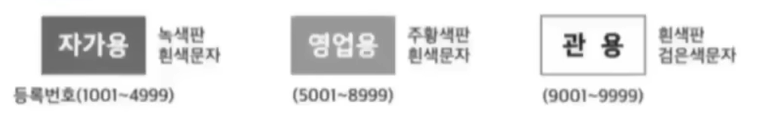
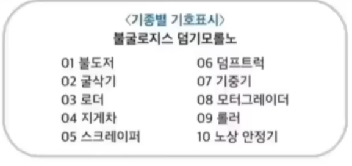
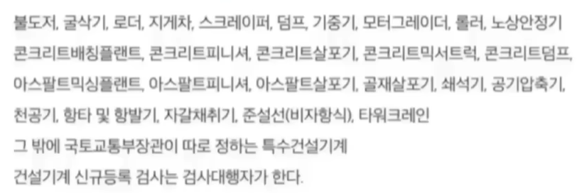

## 등록 신청

- 건설기계 등록은 대통령령에 따라
- 건설기계 소유자의 주소지 또는 사용본거지를 관할하는 시도지사에게 신청
- 취득일로부터 2월이내에 등록신청해야 함

---

## 등록 신청 시 제출하는 서류

- 건설기계 제작증
- 수입면장 등 수입사실 증명 서류
- 매수증서
- 건설기계 소유자임을 증명하는 서류
- 선설기계 제원표
- 보험 또는 공제에 가입을 증명하는 서류

---

## 등록 변경 신고

- 등록사항 변경 시 (변경 30일)
- 소유자 또는 점유자는 시도지사에게 변경사항을 신고
- 변경이 있은 날로부터 30일 이내에 신고

---

## 등록 변경 신고 시 제출 서류 [등신검증]

- 건설기계 등록사항 변경 신청서
- 변경내용을 증명하는 서류
- 건설기계 등록증
- 건설기계 검사증 

---

## 등록 이전 신고

- 등록주소지 또는 사용본거지 시도 간 변경이 있을 떄
- 변경이 있은 날로부터 30일 이내에 새로운 등록지를 관할하는 시도지사에게 신고

---

## 등록사항의 변경 또는 등록 이전 신고 대상

- 소유자 변경
- 소유주의 주소지 변경
- 건설기계의 사용본거지 변경
- 건설기계 소재지 변동은 이전신고 대상이 아님!

---

## 등록의 말소

- 등록말소 사유
  - 거짓 그 밖에 부정한 방법으로 등록
  - 구조적 결함으로 반품
  - 차대가 등록 시 차대와 다른 경우
  - 정기검사 유효기간 만료 3개월 이내 시도지사 최고받고도 지정기한까지 정기검사를 받지 아니한 경우
  - 천재지변이나 사고로 멸실
  - 폐기, 교육 안전기준 부적함, 도난, 수출

---

## 등록번호표 (국토교총부령으로 정함)

- 등록 관청, 용도, 기종 및 등록 번호를 표시(연식X)
- 신규등록 시, 시도를 달리하는 등록이전 신고 시, 등록번호 식별 곤한 시
- 등록번호표 제작을 통지 or 명령은 누가하는지? 시도지사
- 철판 또는 알루미늄 판, 압형으로 외곽선 1.5mm 튀어나오게 제작

---

## 등록번호표의 제작

- 제작자는 시도지사의 지정으로 받아야
- 시도지사로부터 제작통지를 받은 건설기계 소유자는 3일 이내 등록번호표제작을 신청하면
- 제작자는 신청을 받은 때로부터 7일 이내에 제작을 하여야 함(3신청7제작)

> 불굴로지스 덤기모롤노

---

## 특별표지판을 부착하여야 할 건설 기계

- 길이 16.7m 초과
- 너비 2.5m 초과
- 높이 4m 초과
- 회전반경 12m 초과
- 총중향 40톤 초과

---

## 임시운행 사유

- 신개발 건설기계의 시험 연구 목적인 경우 3년 이내 임시운행
- 그 외 등록전 임시운행 기간은 15일 이내

---

## 건설기계의 범위(27종 및 특수건설기계)

---

## 정기검사

- 유효기간
  - 타워크레인 6개월
  - 타이어식굴삭기, 덤프트럭, 기중기, 콘크리트믹서, 아스팔트 살포기 1년
  - 로더, 지게차, 모터그레이더, 천공기 2년
  - 그 밖의 건설기계 3년

---

## 정기검사 신청

- 검사 유효기간 만료일 전후 각각 30일 이내에 신청
- 검사신청을 받은 시도지사 또는 검사대행자는 5일 이내에 검사일시와 장소 통지
- 정비업소에서 제동장치에 대해 정기검사에 상당하는 정비를 받은 경우 정기검사에서 그부분의 검사를 면제 받을 수 있음, 이 경우 제동장치 정비 확인서를 제출해야 함

---

## 정기검사의 연기

- 정기검사 연기 기간은 6월 이내
- 해외임대를 위해 일시반출: 반출기간 내
- 압류된 건설기계: 압류기간이내
- 대여업을 휴지하는 경우: 휴지기간 이내
- 타워크레인 천공기 해체된 경우: 해체되어 있는 기간 이내
- 검사 연기신청을 받은 시도지사 또는 검사 대행자는 연기 신청일로부터 5일 이내 연기 여부를 결정하여 신청인에게 통지

---

## 정기검사의 최고

- 시도지사는 건설기계 소유자에게 정기검사 유효기간 만료된 날로부터 3개월 이내에 정기검사를 받고록 최고함

---

## 건설기계의 구조변경

- 건설기계의 구조변경 범위는
  - 건설기계의 길이, 너비, 높이 변경
  - 동력전달, 주행 제동 등... 각종 장치의 형식 변경 
  - 수상 작업용 건설기계 선체의 형식 변경
  - 구조변경 범위에 속하지 않는 것
  - 적재함 용량 증가를 위한 구조 변경, 건설기계의 기종 변경
  - 육상 작업용 건설기계의 규격증가는 구조변경 범위에 속하지 않음
- 구조 변경 검사는 변경/개조한 날로부터 20일 이내에 신청해야 함

---

## 수시검사

- 성능이 불량하거나 사고가 자주 발생하는 건설기계의 안전성을 점검하기 위해 수시로 실시 또는 소유자의 신청을 받아 실시
- 시도지사는 수시검사 명령 시 검사일 10일 이전에 명령서를 교부함

---

## 검사대행자

- 국토부장관은 시설과 기술을 갖춘 검사대행자를 지정할 수 있음
- 검사대행자 신청서 첨부서류[규시기]
  - 검사업무규정안
  - 시설 보유증명서
  - 기술자 보유증명서
  - 장비 보유증명서X
- 우리나라 정기검사 대행기관 - 건설기계안전관리원

 

- 검사소 이외의 장소에서 출장검사를 받을 수 있는 경우?
  - 도서지역
  - 너비 2.5m 초과
  - 차제중량 40톤 초과
  - 축중 10톤 초과
  - 최고속도 시간당 35km 미만인 경우

---

## 조종사의 면허 종류

- 불도저 - 5톤 미만 불도저
- 굴삭기 - 3톤 미만 굴삭기
- 로더 - 3톤 미안 로더, 5톤 미만 로더
- 지게차 - 3톤 미만 지게차
- 천공기 - 5톤 미만 천공기
- 타워크레인 - 3톤 미만 타워크레인
- 기중기/롤러/콘크리트펌프/쇄석기/공기압축기/준설선

---

## 자동차 1종면허로 조종가능 건설기계

- 덤프, 믹서, 콘크리트펌프카, 아스팔트살포기
- 천공기(트럭적재식), 노상안정기(콘크리트살포기X)

---

## 소형건설기계 조종면허

- 시도지사 지정 교육기관에서 교육을 마친 경우 발급
- 교육시간
  - 3톤 미만 굴삭기, 지게차, 로더
    - 이론 6시간, 실습 6시산 총 12시간
  - 3톤 이상 5톤 미만 로더, 5톤 미만 불도저
    - 이론 6시간, 실습 12시간 총 18시간
    - 3톤 미만 지게차를 조종하려는 자는 반드시 자동차운전면허를 소지해야 함

---

## 조종면허 적성검사 기준

- 시력: 두 눈 뜨고 0.7 이상 각각 0.3 이상
- 청력: 55데시벨
- 언어분별력: 80% 이상
- 시각: 150도 이상
- 정신질환자, 마약, 알콜중독자가 아닐 것
- 정기적성검사: 10년마다
- 수시적성검사: 장애 사유 발생 시 

---

## 건설기계 검사기준(제동장치 제동력)

- 모든 축 제동력 합이 축중(빈차)의 50% 이상일 것
- 동일 차축 좌우 바퀴 제동력 편차는 축중 8% 이내일 것
- 주체제동력의 합이 빈차중량의 20% 이상일 것

---

## 건설기계 검사기준(원동기 성능)

- 작동상태에서 심한 진동/이상음 없을 것
- 원동기 설치 상태가 확실할 것
- 배출가스 허용기준에 적합할 것

---

## 건설기계 사업

- 대여업/정비업/매매업
- 대통령령으로 정하며, 시/군/구청자에게 등록  

---

## 건설장비 정비업

- 종합/부분/전문 건설기계 정비업
- 종합 정비업 사업범위: 롤러, 링크, 트랙슈의 재생, 프레임 조정, 변속기 분해정비, 엔진 탈부착 및 정비
- 부분 정비업 사업범위: 프레임 조정, 롤러, 링크, 트랙슈 재생을 제외한 차제
- 전문 정비업 사업범위: 유압정비업, 원동기 전문 정비업으로 나뉨