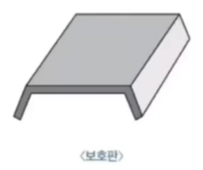
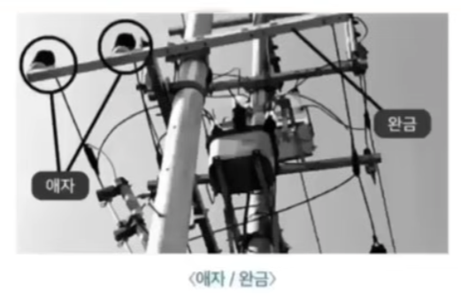

## 재해와 재해예방 

- 재해란 사고의 결과로 인한 인명피해와 재산 손실
- 산업재해란 근로자가 업무에 관계되는 원인, 작업, 업무로 인해 사망, 부상, 질병에 걸리는 것
- 산업안전 3요소: 기술적, 교육적, 관리적 요소[기교관]
- 재해예방 4원칙: 예방가능, 손실 우연, 원인계기, 대책 선정[예우원대]
- 폐기물은 정해진 위치에 모아두고, 공구는 정해진 장소에 O
  - But 소화기 근처나 통로, 창문에 물건 적재 X
- 건설 산업 현장에서 재해 발생원인은?
  - 불안전 행위 1위 / 불안전 조건 2위 / 불가항력 3위

---

## 사고 원인의 구분

- 직접적 원인 / 간접적 원인
- 안전의식 부족(직)
- 안전교육 부족(간)
- 작업자체의 위험성(직)
- 불안전한 조명(직)
- 방호장치 결함(직)
- 안전수칙 미준수(직)
- 작업자의 피로(생리적원인 - 직)
- 작업 용이성 X

--- 

## 사고의 직접적 원인

- 불안전행동
- 불안전한 작업태도, 위험장소 출입
- 작업자의 실수, 안전수칙 미준수
- 보호구 미착용, 작업자의 피로
- 불안정환경
- 기계결함, 방호장치 결함
- 불안전 조명, 안전장치 미흡

---

## 사고의 간접적 원인

- 안전교육미비
- 안전수칙 미수립
- 작업 중 안전관리 미흡
- 가정환경
- 사회불만
- 직접원인 외 요인

> 작업자는 작업 시 안전 수칙, 작업량, 기계공구 사용법 숙지
>
> but 경영관리파악 X

--- 

## 산업재해 분류 <경상해와 중경상>

- 경상해: 부상으로 1일 ~ 7일하 노동상실
- 중경상: 부상으로 8일 이상 노동상실
- 무상해: 응급처치 이하 상처 작업 종사하면서 치료가 가능한 정도

> 응급처치 시 의식확인, 상처보호, 출혈 시 지혈함 (격리한다 X)

---

## 굴착작업 시 주의사항

> 도시가스 공급지역 굴착 시 그림과 같은 판을 발견했다면?

- 도시가스배관 지하 매설 시 상수도관 등 다른 시설물과 이격거리는 30cm 이상
- 도시가스배관 매설 시 라인 마크는 배관길이 50미터 마다
- 가스배관 매설위치 확인 시 배관주위 1m 이내는 인력으로 굴착
- 굴착공사 중 0.3m 깊이에서 물체발견 시 이것은 도시가스 배관을 보호하는 보호관
- 도로 굴착 시 가스배관이 20m 이상 노출되면 가스누출경보기를 20m마다 설치해야 함
- 고압선 위험표지시트의 직하에는 전력케이블이 묻혀있음
  - 굴착 중 발견 시 즉시 굴착을 중지하고 해당시설기관에 연락
- 지중전선로 직접 매설식의 최소 토관 깊이는 0.6m 이상

---

## 전기 안전

- 교류전기가 600V를 초과하면 고전압이라고 함
- 전선로 부근에서 건설기계로 작업 시
  - 사전에 인근 설비관련 소유자 또는 관리자에게 연락함(시군구청 X, 경찰서 X)
- 절연을 위해 전선을 기계적으로 고정시키기 위해 철탑의 완금에 설치하는 것은 애자
- 고압 케이블의 지하매설법: 직매식, 관로식, 전력구식(궤도식 X)[직관전]
- 차도에서 전력케이블은 1.2~1.5m 이상 매설
- 육안으로 봤을 때 고압전선인가를 무엇을 보고 판단하는지
  - 현수애자의 개수 (2~3개 22.9kV / 4~5개 66kV / 9~10개 154kV 이상)

---

