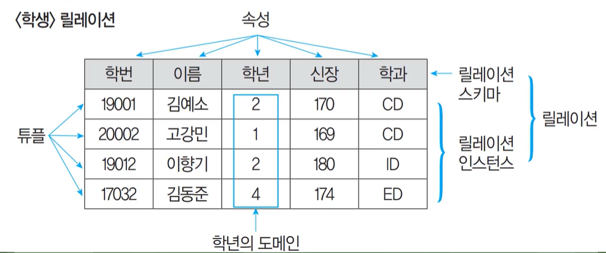

## 관계형 데이터베이스

- 2차원적인 표(Table)를 이용해서 데이터 상호 관계를 정의하는 데이터베이스
- 1970년 IBM에 근무하던 코드에 의해 처음 제안되었음
- 개체(Entity)와 관계(Relationship)를 모두 릴레이션(Relation)이라는 표(Table)로 표현하기 때문에 개체를 릴레이션과 관계 릴레이션이 존재
- 장점: 간결하고 보기 편리하며, 다른 데이터베이스로의 변환이 용이
- 단점: 성능이 다소 떨어짐

---

## 관계형 데이터베이스의 릴레이션 구조

- 튜플 = 카디널리티 = 대응수 = 레코드 = 기수

 

#### 튜플(Tuple)

- **릴레이션을 구성하는 각각의 행**
- 튜플은 속성의 모임으로 구성
- 파일 구조에서 레코드와 같은 의미
- 튜플의 수를 카디널리티 또는 기수, 대응수라고 함

 

#### 속성(Attribute)

- **데이터베이스를 구성하는 가장 작은 논리적 단위**
- 파일 구조상의 데이터 항목 또는 데이터 필드에 해당됨
- 속성은 개체의 특성을 기술
- 속성의 수를 디그리 또는 차수라고 함

 

#### 도메인(Domain)

- 하나의 애트리뷰트가 취할 수 있는 같은 타입의 원자 값들의 집합
- 도메인은 실제 애프리뷰트 값이 나타날 때 그 값의 합법 여부를 시스템이 검사하는 데에도 이용됨

---

## 릴레이션의 특징

- 한 릴레이션에는 똑같은 튜플이 포함될 수 없으므로 릴레이션에 포함된 튜플들은 모두 상이
- 한 릴레이션에 포함된 튜플 사이에는 순서가 없음
- 튜플들의 삽입, 삭제 등의 작업으로 인해 릴레이션은 시간에 따라 변함
- 렐레이션 스키마를 구성하는 속성들 간의 순서는 중요하지 않음
- 속성의 유일한 식별을 위해 속성의 명칭은 유일해야 하지만, 속성을 구성하는 값은 동일한 값이 있을 수 있음
- 릴레이션을 구성하는 튜플을 유일하게 식별하기 위해 속성들의 부분집합을 키로 설정
- 속서의 값은 논리적으로 더 이상 쪼갤 수 없는 원자값만을 저장