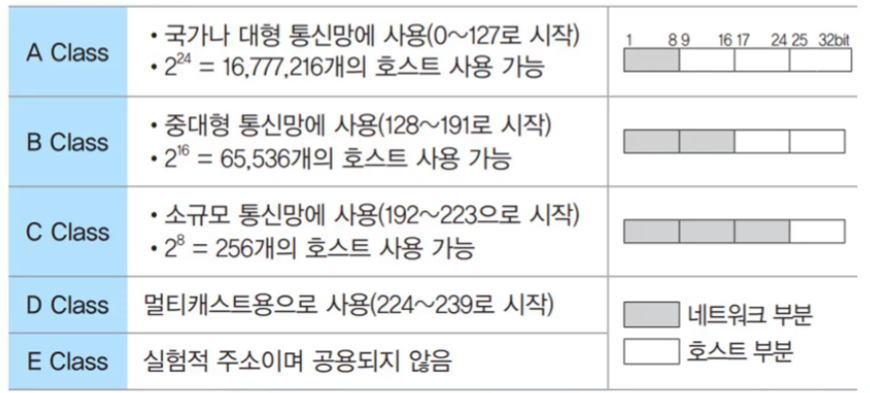

## 인터넷

- 인터넷이란 TCP/IP 프로토콜을 기반으로 하여 전 세계 수많은 컴퓨터와 네트워크들이 연결된 광범위한 컴퓨터 동신망
- 인터넷에 연결된 모든 컴퓨터는 고유한 IP 주소를 갖음

---

## IP 주소

- IP 주소는 **인터넷에 연결된 모든 컴퓨터 자원을 구분하기 위한 고유한 주소**
- 8비트씩 4부분, 총 32비트로 구성
- IP 주소는 네트워크 부분의 길이에 따라 다음과 같이 A 클래스에서 E클래스까지 총 5단계로 구성

