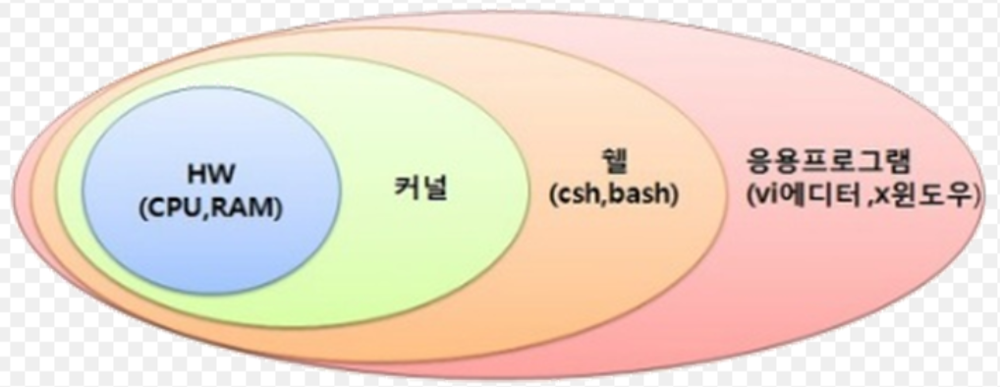
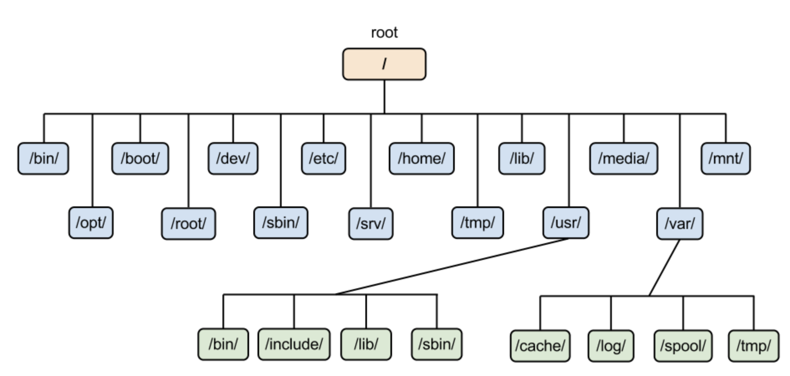

## 리눅스 개요
> Linux kernel 기반의 오픈 소스 유닉스 계열 운영체제입니다.

 

## 주요 장점
- 공개 운영체제로 무료 사용 가능
- 강력한 보안 기능 제공
- 다양한 하드웨어 지원 및 유닉스 호환성
- 폭넓은 개발 언어 지원

 

## 주의사항
- 문제 발생 시 보상체계 부재
- 한글 사용의 제약
- 기술 지원이 제한적
- 높은 사용자 숙련도 요구

 

## 시스템 구성

- shell
  - 사용자-커널 간 인터페이스
  - 명령어 해석 및 프로그래밍 기능

- Kernel
  - 운영체제의 핵심 요소
  - 하드웨어 인터페이스 담당
  - 시스템 자원 관리 (디바이스, 프로세스, 메모리)

- File System

 

## 리눅스 디렉터리 구조
