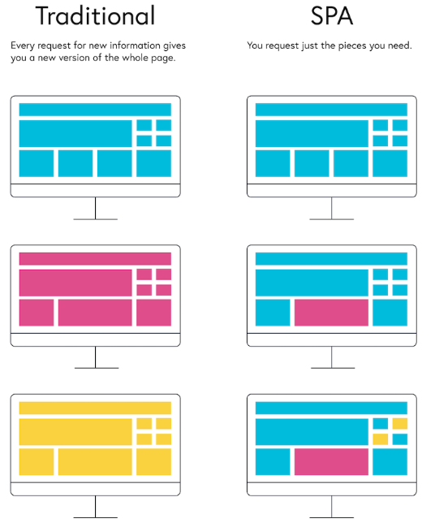

## 웹 동작 방식 1
- 화면에 대한 View를 서버에서 만들어서 브라우저에게 전달
- 브라우저는 받은 view를 화면에 그려준다

<br> 

## 웹 동작 방식 2
- view를 받은 뒤 화면의 부분 변경이 필요한 부분을 AJAX 요청한다
- JavaScript를 사용하여 AJAX 요청
- 주로 data를 요청하게 된다
- 문제점
  - View가 복잡한 UI일 경우 점점 어려워지고 힘들어진다
  - 부분 변경해야 할 부분이 너무 많다
  - 이러한 이련의 동작들이 클라이언트에서 이루어져야 하기 때문에 선능에 문제가 발생
    

<br>

## REACT
- AJAX를 사용하여 SPA를 구현하되 클라이언트 프로그래밍이 복잡해지지는 않도록 한다
- 데이터 변경 감지 -> UI 자동 업데이트 (Observer 패턴)
- React는 데이터 변경을 감지하는 엔진 역할을 수행하는 데 이는 계속 작동해야 하는 데몬 프로세스이다 (Node.js)

## React 설치 (Vite)
```bash
npm create vite@latest app -- --template react
npx create-react-app
cd my-app
npm run dev
```
