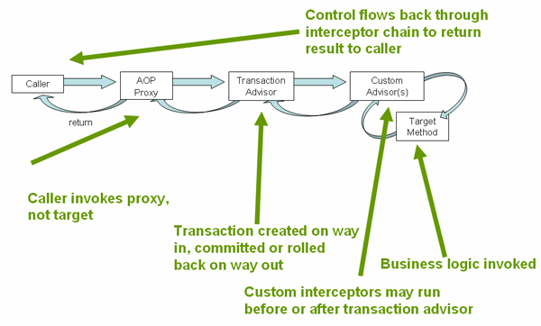

## 핵심 개념과 동작 흐름

#### 선언적 트랜잭션이 어떤 방식으로 동작하는지

- 선언적 트랜잭션은 `@Transactional` 어노테이션 + `@EnableTransactionManagement` 같은 설정을 통해 활성화됨
- 내부적으로 AOP proxy가 생성되고 그 proxy가 메서드 호출 시 TransactionInterceptor를 통해 트랜잭션의 시작/커밋/롤백을 관리
- 트랜잭션 advice는 메서드 메타데이터를 읽고 어떤 동작을 적용할지 결정

 

#### 트랜잭션 manager 타입 구분: 명령형 vs 반응형

- 메서드의 반환 타입을 보고 명령형 트랜잭션 경로와 반응형 트랜잭션 경로를 구분
- 예를 들어 반환 타입이 `Publisher`와 같은 reactive 유형이면 ReactiveTransactionManager를 사용하고, 그렇지 않으면 기존의 PlatformTransactionManager 사용하는 식
- 논리적 컨텍스트를 통해 트랜잭션 상태를 유지해야 하고, 같은 reactive 파이프라인 내에서 실행되는 데이터 액세스 작업만 참여 가능

 

#### Proxy + Interceptor 구조

- `TransactionInterceptor`가 중요한 역할
- 메서드가 호출될 때 proxy가 가로채서(intercept) 트랜잭션을 시작하고, 메서드 실행 후 반환 또는 예외에 따라 커밋 또는 롤백을 수행
- AOP proxy는 대상 객체의 public 메서드를 감싸서 동작
- 즉, 호출자가 대상 객체의 메서드를 직접 호출하는 것이 아니라, proxy를 통해 호출

 

#### 설정 가능한 속성들 및 동작의 제어

- declarative 트랜잭션에서 설정 가능한 것들:
  - 어떤 트랜잭션에서 매니저를 사용할지 설정
  - rollback 규칙: 어떤 예외에서 rollback이 일어날지 `@Transactional`의 `rollback`/`noRollback` 등의 속성으로 지정 가능
  - 전파, 격리, 타임아웃, 읽기 전용 등 메서드별로 다르게 설정 가능

