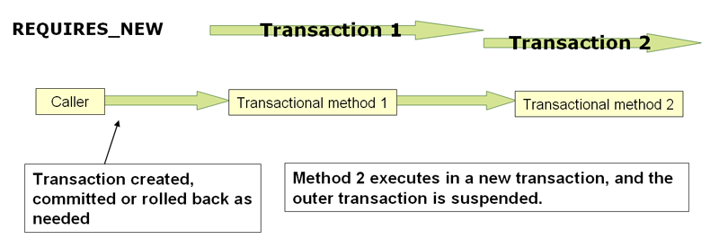

## Transation Propagation 의미

> 트랜잭션 전파는 하나의 트랜잭션 경계가 있을 때, 다른 트랜잭션이 호출되면 어떻게 동작할지를 정의하는 설정
>
> 예, 서비스 A에서 트랜잭션이 걸려있고, 그 안에서 서비스 B가 호출될 때, 서비스 B의 트랜잭션 설정이 REQUIRED인지 REQUIRES_NEW인지에 따라 행동이 달라짐

 

## 주요 Propagation 모드 & 특징

#### PROPAGATION_REQUIRED (기본값)

- 기본 설정
- 만약 호출 시점에 이미 트랜잭션이 있으면 그 트랜잭션에 참여하고, 없으면 새로 시작
- 내외부 트랜잭션이 같은 물리적 트랜잭션을 공유하게 됨

 

#### PROPAGATION_REQUIRES_NEW

- 항상 새로운 물리 트랜잭션을 만듦
- 만약 외부에 트랜잭션이 있으면 그걸 잠시 중단하고 새 트랜잭션을 실행한 후, 완료되면 외부 트랜잭션 복귀
- 내부 트랜잭션의 롤백이나 커밋이 외부 트랜잭션에 영향을 주지 않음

#### PROPAGATION_NESTED

- 내부 저장점을 사용하는 모드로, 같은 물리 트랜잭션 내에서 내부 작업만 부분적으로 롤백 가능
- 외부 트랜잭션은 계속 진행 가능
- JDBC 리소스가 제공되고, 트랜잭션 매니저가 savepoint를 지원해야만 동작

 

## 유의사항

- 내부 트랜잭션 또는 `REQUIRES_NEW` 사용 시, 외부 트랜잭션이 잠시 중단되었다가 재개됨
  - 연결 자원의 관리, 커넥션 풀 크기 등에 영향을 줄 수 있음
- `NESTED` 모드는 savepoint를 지원하지 않는 트랜잭션 매니저에서는 사용 불가하거나 예외가 발생할 수 있음

 

## 정리

> Transaction propagation은 하나의 트랜잭션 범위 내에서 호출되는 메서드들이 기존 트랜잭션에 참여할지, 아니면 새 트랜잭션을 만들지, 또는 savepoint를 활용해 부분 롤백 가능하게 할지 등의 동작 방식을 조정하는 설정