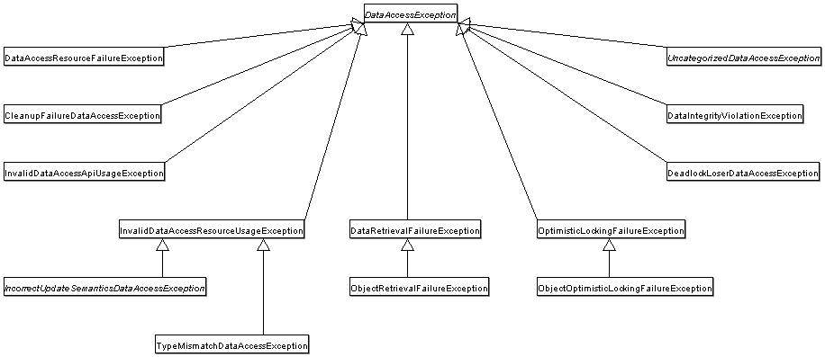

## 개념 및 목적

> DAO(Data Access Object)란, 어플리케이션에서 비즈니스 로직과 데이터 저장소를 분리해주는 패턴
>
> Spring의 DAO 지원은 다양한 데이터 접근 기술에 대해 일관성 있는 API와 예외 처리 방식, 그리고 템플릿/지원 클래스를 제공해서 DAO 구현을 쉽게하고 유지보수를 수월하게 만드는 것이 목적

<br>

## 주요 기능/구성 요소

#### 일관된 예외 계층(Exception Hierarchy)

- JDBC의 `SQLException`, Hibernate/JPA의 예외 등을 Spring의 `DataAccessException` 상속 구조로 감싸서 던지기
- 데이터 접근 기술이 바뀌어도 예외 처리가 일정하게 가능하게 함



<br>

#### @Repository 어노테이션

- DAO 혹은 리포지토리 클래스에 붙이기만 하면 컴포넌트 스캔 시 찾아서 빈으로 등록해주고 기술-특정 예외
- Spring 예외 계층으로 변환해주는 역할도 함

<br>

#### 지원 클래스(Template/Support Classes)

- JDBC 쪽 템플릿인 `JdbcTemplate`, ORM 쪽의 `JpaTemplate` / `HibernateTemplate` / `JpaDaoSupport` / `HibernateDaoSupport` 등의 클래스를 제공해서 DAO 구현 시 반복되는 코드를 줄여줌

<br>

#### 의존성 주입(Dependency Injection)

- DAO 클래스 내에서 필요한 DataSource, EntityManager, SessionFactory 등 리소스를 `@Autowired`. `@PersistenceContext` 등을 통해 주입하여 외부 설정과 분리됨

<br>

## 예시 흐름

- DAO 인터페이스를 정의하고, 그 구현체 클래스에 `@Repository` 어노테이션 붙임
- 필요한 데이터 접근 기술에 맞는 자원을 주입
- 비즈니스 로직에서는 DAO 인터페이스만 호출 ➡️ 기술 구현체나 상세 설정이 바뀌어도 비즈니스 코드는 바뀌지 않음
- 예외가 발생하면 Spring의 `DataAccessException`과 그 하위 예외들이 던져지므로, 비즈니스 로직에서는 기술에 종속적인 예외 처리 없이 일관성 있게 처리

```java
@Repository
public class UserDaoImpl implements UserDao {

    @Autowired
    private JdbcTemplate jdbcTemplate;

    @Override
    public User findById(Long id) {
        try {
            return jdbcTemplate.queryForObject("SELECT * FROM users WHERE id = ?", new Object[]{id}, new UserRowMapper());
        } catch (DataAccessException e) {
            // 예외 처리
            throw e;
        }
    }
}
```

<br>

## 정리

> Spring의 DAO Support는 DAO 패턴을 활용하여 비즈니스 계층과 데이터 접근 계층을 분리하고 다양한 기술에 대해 반복되는 리소스 관리 및 예외 처리를 일과된 API와 지원 클래스를 통해 단순화해주는 기능