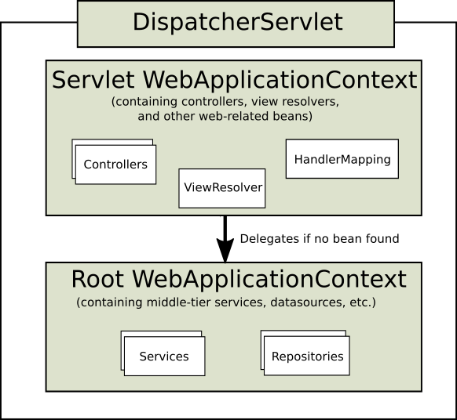

## Context 계층이란

- `DispatcherServlet`은 `WebApplicationContext`를 기대함. 이 `WebApplicationContext`는 연결된 `ServletContext` 및 해당 `Servlet`과 연관
- 보통 하나의 `WebApplicationContext`만 사용해도 충분하지만, 여러 `DispatcherServlet` 인스턴스를 사용하는 복잡한 웹 어플리케이션에서는 context 계층 구조를 구성할 수 있음
- 루트 `WebApplicationContext`가 공통 인프라 빈을 갖고, 각 Servlet별 하위 `WebApplicationContext`가 개별 기능 설정을 담당
- 루트 컨텍스트는 여러 Servlet 인스턴스 간 공유되는 인프라를 보관하고, 자식 컨텍스는 Servlet 특화 빈을 선언
- 자식은 루트 컨텍스트의 빈을 상속하지만 필요시 동일 이름의 빈을 오버라이드할 수 있음

 