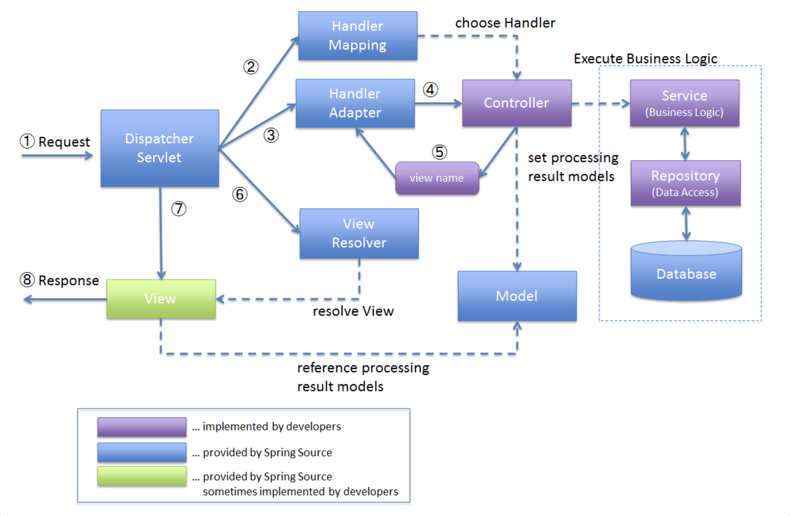

## DispatcherServlet의 요청 처리 흐름

#### 1. WebApplication Context 바인딩

- `DispatcherServlet`은 내부적으로 `WebApplicationContext` 인스턴스를 찾아서 요청 객체에 바인딩
- 이 바인딩은 `DispatcherServlet.WEB_APPLICATION_CONTEXT_ATTRIBUTE` 키로 요청 속성에 저장

 

#### 2. Locale 및 Theme 결정자 바인딩

- `LocaleResolver` 빈이 요청에 바인딩되어, 이후 요청 처리를 위한 locale 판별에 쓰임
- `ThemeResolver` 빈도 요청에 바인딩되어 테마를 결정하는 데 사용됨

 

#### 3. 멀티파트 요청 처리(파일 업로드 등)

- 만약 멀티파트 요청이 발생할 경우, `MultipartResolver`가 작동해서 원래 `HttpServletRequest`를 래핑한 `MultipartHttpServletRequest`로 변환

 

#### 4. 핸들러 검색 및 실행 체인 구성

- 요청 URL, HTTP 메서드 등 조건으로 어떤 핸들러가 처리할지 결정하기 위해 `HandlerMapping` 빈들이 검색됨
- 선택된 핸들러와 연관된 pre-processors, post-processors 등을 포함한 실행 체인이 구성됨
- 핸들러 방식이 어노테이션 기반 컨트롤러 등일 경우, `HandlerAdapter`가 호출을 담당

 

#### 5. 모델 반환 및 뷰 렌더링

- 핸들러가 모델 또는 뷰 이름을 반환하면, 그에 따라 뷰를 찾고 렌더링을 수행
- 만약 중간에 preprocessors나 postprocessors가 응답을 직접 완료했다면, 뷰 렌더링 단계가 생략될 수 있음

 

#### 6. 예외 처리

- 요청 처리 과정에서 예외가 발생하면 `HandlerExceptionResolver` 빈들이 동작해서 그 예외를 적절한 형태로 매핑하고 응답으로 돌려보냄

 

#### 7. HTTP 캐싱 지원

- 핸들러 쪽에서 `WebRequest`의 `checkNotModified()` 메서드를 사용하여 응답이 조건부 GET에 맞게 "변경 없음" 응답을 반환할 수 있음

 

## DispatcherServlet 초기화 설정 파라미터

- `contextClass`: `ConfigurableWebApplicationContext` 구현 클래스를 지정해서, 이 서블릿이 사용할 컨텍스트 클래스를 정의 (기본 - `XmlWebApplicationContext`)
- `contextConfigLocation`: 컨텍스트 설정 파일 위치 문자열을 지정, 여러 경로를 콤마로 구분 가능, 최근 선어된 위치가 우선 순위를 가짐
- `namespace`: `WebApplicationContext`의 네임스페이스 지정(기본 - `[servlet-name]-servlet`)
- `throwExceptionIfNoHandlerFound`: 요청에 매핑된 핸들러가 없을 때 `NoHandlerFoundException`을 던질지 여부, 이 예외를 `HandlerExceptionResolver` 등에 의해 처리할 수 있음

> 참고: 만약 default servlet handling이 구성되어 있다면 매핑되지 않은 요청은 기본 서블릿에게 위임되고 404 예외는 발생하지 않음
{: .prompt-info }

