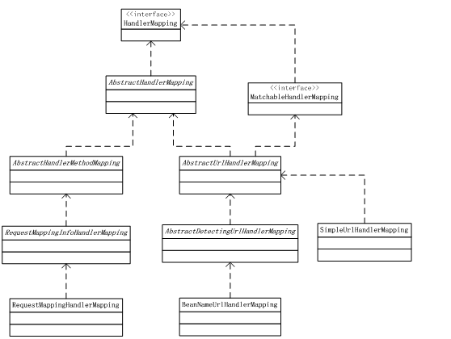

## 요약

> 클라이언트가 요청한 requestURI로부터 스프링이 내부적으로 어떤 "lookup path"를 결정하고, 그 경로를 기준으로 핸들러 매핑을 수행하는 과정을 설명

 

## 경로 구성 요소와 문제점

- Servlet API는 요청 경로를 `requestURI`와 `contextPath`, `servletPath`, `pathInfo` 등으로 나눠서 제공
- 스프링 MVC는 행들러 매핑을 위해 `contextPath`나 `servletMapping` 접두사를 저거한 "lookup path"를 사용
- 하지만 `servletPath`와 `pathInfo`는 이미 디코딩된 값이라서 원본 `requestURI`와 일대일 비교하기 어렵고, `requestURI`를 디코딩하면 예약문자 (`/`, `;` 등)가 변경될 수 있어 경로 구조가 달라질 위험도 존재
- 또한 서블릿 컨테이너마다 `servletPath`의 정규화 정도가 다르기 때문에 `startsWith` 방식 매핑이 신뢰되지 않을 수 있음

 

## 해결 방법과 신규 매칭 방식

- 가능한 경우, `DispatcherServlet`을 기본 서블릿 매핑으로 설정하면 `servletPath`를 무시하고도 경로를 바로 처리할 수 있음
- 만약 prefix 기반 매핑을 써야 한다면, Spring 설정에서 `UrlPathHelper`의 `alwaysUseFullPath` 옵션을 사용해서 전체 디코딩 경로를 사용할 수 있음
- 다만, 디코딩된 경로가 원래 구조를 변경할 위험을 줄이기 위해 `PathPatternParser` + `PathPattern` 반식이 도입
  - 이 방식은 요청 경로를 미리 파싱된 구조(`RequestPath`)로 보고, 각 경로 세그먼트 단위로 비교
  - 인코딩된 예약 문자를 세그먼트별로 안전하게 디코딩/처리할 수 있어서 경로 구조가 흐트러지는 위험을 줄일 수 있음
  - prefix 매핑 등을 허용하면서도 안정적인 매칭 가능

 

