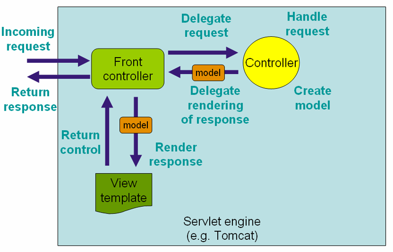

## 개요

- 요청 URL이 컨트롤러의 핸들러 메서드에 매핑되는 과정에서 경로 매핑은 매우 중요한 역할을 함
- Spring MVC에서는 `@RequestMapping` 등에 지정된 경로 패턴이 들어오는 요청 경로와 비교되어 핸들러가 선택됨
- 문서는 이 매칭 방식을 커스터마이즈할 수 있는 `PathMatchConfgurer` 설정을 설명하고 있음
- 특히 Spring 5 이상에서는 더 효율적이고 안전한 매칭 방식인 `PathPatternParser` 기반 매칭이 기본적으로 지원




<br>

## 주요 설정 옵션

> `WebMvcConfigurer` 인터페이스를 구현하여 `configurePathMatch` 메서드를 활용하면 여러 경로 매칭 옵션을 조정할 수 있음

```java
@Configuration
public class WebConfiguration implements WebMvcConfigurer {
    @Override
    public void configurePathMatch(PathMatchConfigurer configurer) {
        // 예: 모든 @RestController 타입 핸들러에 /api 접두사 자동 추가
        configurer.addPathPrefix("/api", 
            HandlerTypePredicate.forAnnotation(RestController.class));
        
        // 추가 설정 가능 (예: patternParser 지정)
        // configurer.setPatternParser(pathPatternParser());
    }

    private PathPatternParser pathPatternParser() {
        PathPatternParser parser = new PathPatternParser();
        // 커스터마이즈 가능
        return parser;
    }
}
```


```xml
<mvc:annotation-driven>
    <mvc:path-matching
        path-helper="pathHelper"
        path-matcher="pathMatcher"/>
</mvc:annotation-driven>

<bean id="pathHelper" class="com.example.app.MyPathHelper"/>
<bean id="pathMatcher" class="com.example.app.MyPathMatcher"/>
```

<br>

## 지원 기능 및 주의사항

#### 주요 기능

- 접두사 자동 추가(`addPathPrefix`)
  - 요청 핸들러 타입에 대한 특정 URL 접두사(예:`/api`)를 자동으로 매핑할 수 있음
- 매칭 전략 선택
  - `AntPathMatcher`: 전통적인 방식으로 와일드카드(`*`, `**`, `?`) 지원
  - `PathPatternParser`: Spring 5.3 이상에서 도입된 새로운 방식으로, 파싱을 통해 더 빠르고 안전한 매칭을 제공
- 기타 `UrlPathHelper`, `PathMatcher` 등의 커스터마이징 가능

#### 주의사항

- `PathPatternParser` 방식이 기본화됨에 따라, 이전 스타일만을 가정한 설정이 충돌할 수 있음
- URL 인코딩/디코딩 이수: `requestURI`에서 인코딩된 경로가 디코딩되면서 구조가 바뀔 수 있기 때문에 `PathPatternParser` 방식이 더 안전하다는 설명이 있음
- 개발자가 직접 `AntPathMatcher` 특유의 기능을 활용했다면 `PathPatternParser` 적용 시 제한이 있을 수 있음

<br>

## 설정해야하는 이유

- REST API 설계 시, 모든 `@RestController` 앞에 `/api` 접두사를 붙이고 싶을 때 ➡️ `addPathPrefix("/api", HandlerTypePredicate.forAnnotation(RestController.class))` 설정 등이 도움이 됨
- 과거 `AntPathMatcher` 기반 방식에서 업그레이드 중이라면 매칭 전략이 달라지는 점을 체크해야 함