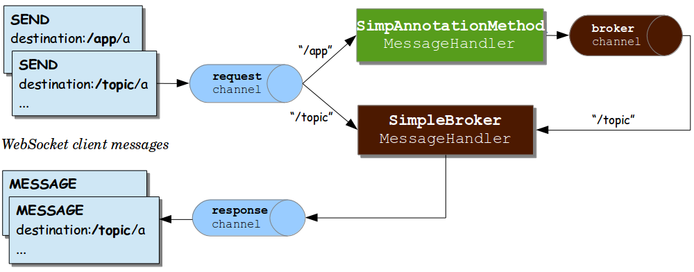

## 메시지 흐름 개요

- STOMP 엔드포인트가 노출되면, 어플리케이션은 연결된 클라이언트들에 대해 하나의 STOMP 브로커처럼 동작
- 내부적으로 메시지는 여러 채널을 거쳐 흐르며, 핵심적으로 다음 세가지 채널이 등장
    1. `clientInboundChannel`: WebSocket 클라이언트로부터 들어오는 메시지를 처리함
    2. `brokerChannel`: 서버 내부 어플리케이션 코드가 브로커 쪽으로 보내는 메시지용
    3. `clientOutboundChannel`: 브로커 또는 어플리케이션 코드가 클라이언트로 보내는 메시지를 처리함

 

## 흐름 상세

#### 내장(Simple) 브로커 사용 시

- 클라이언트 ➡️ WebSocket 연결 ➡️ STOMP 프레임 ➡️ Spring 내부 `Message` 객체로 변환 ➡️ `clientInboundChannel`로 전달
- 메시지의 목적지 헤더가 `/app` 등으로 시작하면, 이는 `@MessageMapping` 등이 붙은 컨트롤러 메서드로 라우팅 됨
- 컨트롤러 메서드에서 처리가 끝난 후 결과가 다시 `brokerChannel`로 보내지고 브로커가 이를 `/topic` 또는 `/queue` 등을 통해 구독된 클라이언트들에게 `clientOutboundChannel`을 통해 전달
